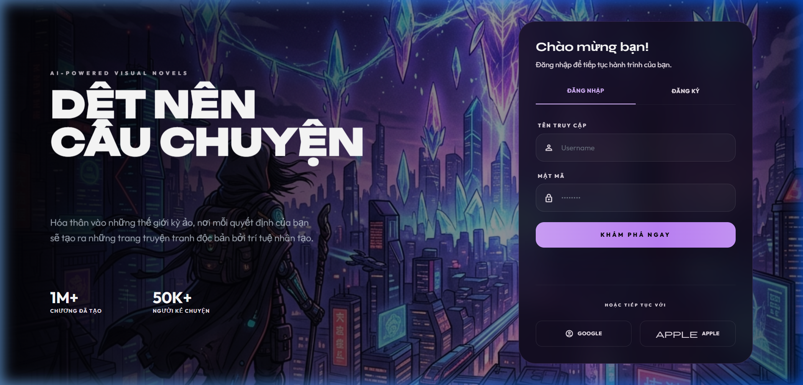
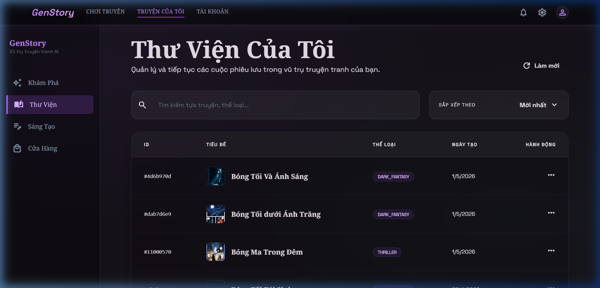
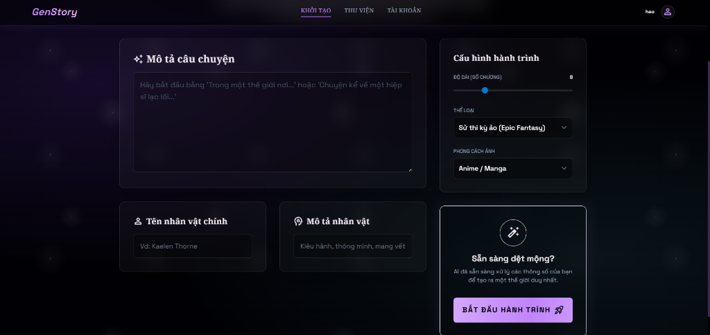
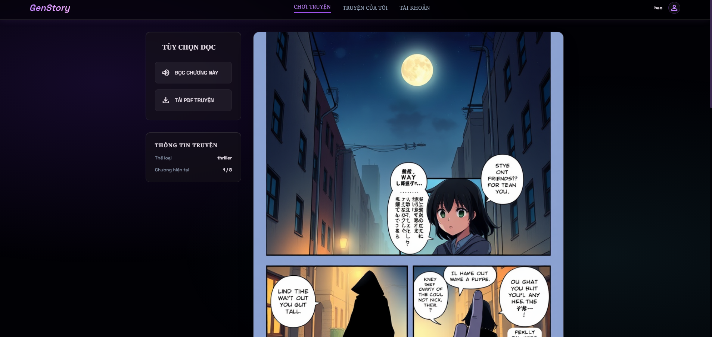
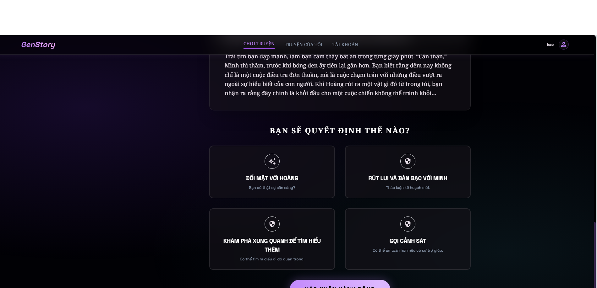

# GenStory - AI-Powered Visual Novel Engine



GenStory is an immersive, interactive storytelling platform powered by AI. It allows users to weave unique narratives with vivid manga-style illustrations and expressive voiceovers, turning simple ideas into fully realized visual novels.

## 📸 Application Showcase

### 1. Immersive Authentication
A premium, cinematic entry point that sets the stage for your cosmic journey.


### 2. Personal Story Library (Dashboard)
Manage and continue your various adventures across the multiverse.


### 3. Story Creation & Setup
Define your world, genre, and protagonist. Let the AI tailor a unique universe based on your description.


### 4. Interactive Reading Experience
Read your story with AI-generated manga panels, immersive voiceovers, and make critical choices that branch the narrative in real-time.



## ✨ Key Features
- **Intelligent Narrative Generation:** Powered by Google Gemini to create consistent, high-quality story arcs.
- **AI Manga Illustration:** Automatically generates prompts and calls image generation APIs to visualize every chapter.
- **Interactive Branching:** Your choices matter. The AI dynamically generates the next chapter based on your decisions.
- **Text-to-Speech (TTS):** Immersive voice acting powered by FPT.AI to bring characters to life.
- **PDF Export:** Export your complete adventure (text + images) into a high-quality PDF for offline reading.

## 🛠 Tech Stack
- **Backend:** FastAPI (Python 3.10+)
- **Database:** PostgreSQL with SQLAlchemy (Async)
- **AI Engines:** Google Gemini (LLM), HuggingFace (Image Generation), FPT.AI (TTS)
- **Frontend:** Modern HTML5, Tailwind CSS (JIT), Jinja2 Templates
- **Deployment:** Docker & Docker Compose

## 🚀 Getting Started

### Prerequisites
- Docker & Docker Compose
- API Keys: `GOOGLE_API_KEY`, `FPT_API_KEY`, `HF_TOKEN`

### Installation
1. Clone the repository.
2. Create a `.env` file in the root directory and fill in your API keys.
3. Launch the application using Docker:
   ```bash
   docker-compose up --build
   ```
4. Open your browser and navigate to `http://localhost:8000`.

---
*Created by GenStory Team. Powered by Cosmic AI.*
