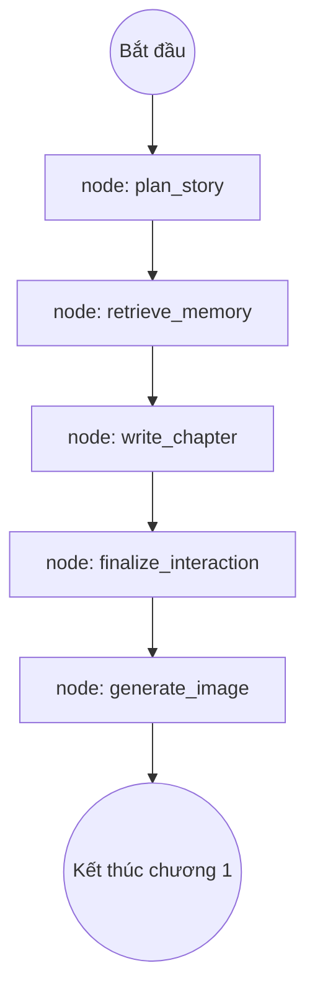
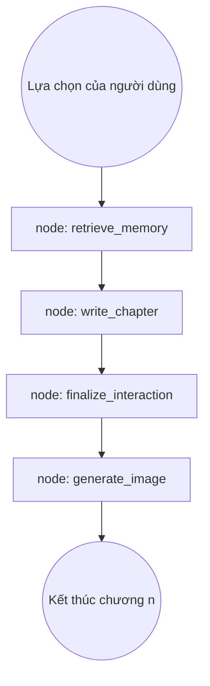

# Kiến trúc Hệ thống Multi-Agent Story Generation

Hệ thống này được thiết kế để tự động hóa việc sáng tạo nội dung truyện tương tác chất lượng cao thông qua mạng lưới các AI Agent chuyên biệt. Sử dụng framework **LangGraph** để điều phối (orchestration), hệ thống đảm bảo tính nhất quán về cốt truyện, bối cảnh và nhân vật trong suốt quá trình phát triển câu chuyện dài.

---

## 1. Tổng quan (Overview)

Mô hình Multi-Agent trong dự án này không chỉ đơn thuần là gọi LLM nhiều lần, mà là một quy trình **Collaborative Intelligence** (Trí tuệ cộng tác). Các Agent được phân chia vai trò rõ ràng, sở hữu "bộ nhớ" riêng và tương tác với nhau thông qua một **StateGraph** tập trung.

### Các đặc điểm cốt lõi:
- **Tách biệt trách nhiệm (Separation of Concerns):** Mỗi Agent giải quyết một bài toán cụ thể: Lập kế hoạch, Viết lách, và Quản lý logic.
- **Tính nhất quán (Story Continuity):** Nhờ cơ chế "World Bible" và "Memory Retrieval", hệ thống tránh được các lỗi logic phổ biến của AI như quên tên nhân vật hoặc thay đổi bối cảnh đột ngột.
- **Tương tác động (Dynamic Interaction):** Hệ thống không viết một mạch từ đầu đến cuối mà dừng lại sau mỗi chương để người dùng đưa ra lựa chọn, ảnh hưởng trực tiếp đến diễn biến tiếp theo.

---

## 2. Các Agent chi tiết (Detailed Agents)

### 2.1 Story Planner Agent (`StoryPlannerAgent`)
Đóng vai trò là **Đạo diễn và Biên kịch trưởng**. Agent này chịu trách nhiệm đặt nền móng cho toàn bộ vũ trụ câu chuyện.

- **Input:** Các tham số cơ bản từ người dùng (Thể loại, mô tả ý tưởng, tên nhân vật, số chương mục tiêu).
- **Quy trình xử lý:**
    1. Sử dụng LLM để mở rộng ý tưởng thô thành một bối cảnh chi tiết.
    2. Xây dựng **World Bible**: Định nghĩa lore, tone giọng, và các quy tắc của thế giới.
    3. Thiết kế **Story Outline**: Tạo ra các "Story Beats" (nhịp truyện) cho từng chương, bao gồm mục tiêu, xung đột và các điểm nút (reveal).
- **Output:** `StorySession` - Một blueprint hoàn chỉnh chứa đựng linh hồn của câu chuyện.

### 2.2 Chapter Writer Agent (`ChapterWriterAgent`)
Đóng vai trò là **Nhà văn (Novelist)**. Đây là Agent có khả năng ngôn ngữ tốt nhất, tập trung vào việc mô tả và biểu cảm.

- **Input:** `StorySession`, nội dung chương trước, lựa chọn hiện tại của người dùng, và các ký ức liên quan được truy xuất từ Database.
- **Quy trình xử lý:**
    1. Phân tích "Beat" của chương hiện tại từ dàn ý.
    2. Kết hợp với lựa chọn của người dùng để tạo ra mạch truyện logic.
    3. Mô tả chi tiết hành động, lời thoại và nội tâm nhân vật.
    4. **Manga Orchestration:** Đưa ra mô tả các khung hình (panels) để phục vụ cho việc tạo ảnh minh họa theo phong cách manga.
- **Output:** `Chapter` - Văn bản thô của chương và mô tả layout hình ảnh.

### 2.3 Interaction Manager Agent (`InteractionManagerAgent`)
Đóng vai trò là **Biên tập viên và Quản lý dữ liệu**. Agent này đảm bảo "sợi dây" liên kết giữa các chương không bị đứt gãy.

- **Input:** Nội dung chương vừa viết và trạng thái hiện tại của thế giới (`Canon`).
- **Quy trình xử lý:**
    1. **Canon Update:** Cập nhật các thay đổi về vị trí, vật phẩm, mối quan hệ nhân vật sau khi chương kết thúc.
    2. **Option Generation:** Tạo ra 3-4 lựa chọn tiếp theo dựa trên diễn biến hiện tại, đảm bảo mỗi lựa chọn đều có sức nặng và dẫn đến các hệ quả khác nhau.
    3. **Summarization:** Tóm tắt chương vừa viết thành các "Memory Entries" để lưu vào bộ nhớ dài hạn.
- **Output:** `Chapter` (đã hoàn thiện với các lựa chọn) và `StoryCanon` đã cập nhật.

---

## 3. Quy trình điều phối (Workflow & Nodes)

Hệ thống sử dụng **LangGraph** để định nghĩa luồng đi của dữ liệu thông qua các Nodes. Có hai luồng chính:

### 3.1 Luồng Khởi tạo (Start Story Flow)

### 3.2 Luồng Tiếp diễn (Next Chapter Flow)

**Chi tiết các Node:**
- **`retrieve_memory_node`**: Sử dụng Vector Search để tìm trong hàng trăm sự kiện cũ những gì liên quan nhất đến chương hiện tại.
- **`generate_image_node`**: Một service riêng biệt (như Stable Diffusion) nhận mô tả từ Writer Agent để tạo ra hình ảnh trực quan.

---

## 4. Cơ chế Bộ nhớ & Hàng rào bảo vệ (Memory & Guardrails)

### 4.1 Cơ chế Bộ nhớ (Memory)
Hệ thống quản lý bộ nhớ qua 3 cấp độ:
1. **World Bible (Ký ức vĩnh cửu):** Tên nhân vật, thế giới, phong cách nghệ thuật. Luôn xuất hiện trong Prompt.
2. **Story Canon (Ký ức trạng thái):** Inventory, vị trí hiện tại, các bí mật đã bật mí. Giúp AI biết nhân vật đang cầm gì, ở đâu.
3. **Vector Memory (Ký ức sự kiện):** Sử dụng Embedding để lưu trữ tóm tắt các chương cũ. Khi viết chương 10, Agent có thể "nhớ" lại một chi tiết nhỏ ở chương 2 nếu chi tiết đó có từ khóa liên quan.

### 4.2 Hàng rào bảo vệ (Guardrails)
Nằm tại `src/core/guardrails.py`, đây là lớp kiểm soát chất lượng:
- **Pydantic Validation:** Mọi Output từ LLM đều được ép kiểu vào các Class (Schema) nghiêm ngặt. Nếu LLM trả về thiếu một trường dữ liệu, Guardrail sẽ bắt lỗi hoặc thực hiện sửa lỗi tự động.
- **Content Safety:** Đảm bảo nội dung không vi phạm các tiêu chuẩn cộng đồng hoặc đi quá xa khỏi thể loại đã chọn.

---

## 5. Công nghệ sử dụng (Tech Stack)

| Thành phần | Công nghệ |
| :--- | :--- |
| **Orchestration** | LangGraph (LangChain ecosystem) |
| **LLM Inference** | OpenAI GPT-4o / Claude 3.5 Sonnet |
| **Data Validation** | Pydantic v2 |
| **Memory Store** | Supabase (PostgreSQL with pgvector) |
| **Prompt Engine** | Jinja2 style templating |

---

## 6. Kết luận
Hệ thống Multi-Agent này không chỉ tối ưu hóa khả năng sáng tạo của AI mà còn giải quyết triệt để bài toán về tính nhất quán trong kể chuyện đường dài. Sự phối hợp giữa Planner, Writer và Interaction Manager tạo nên một vòng lặp khép kín, giúp trải nghiệm của người dùng trở nên chân thực và đầy bất ngờ.
